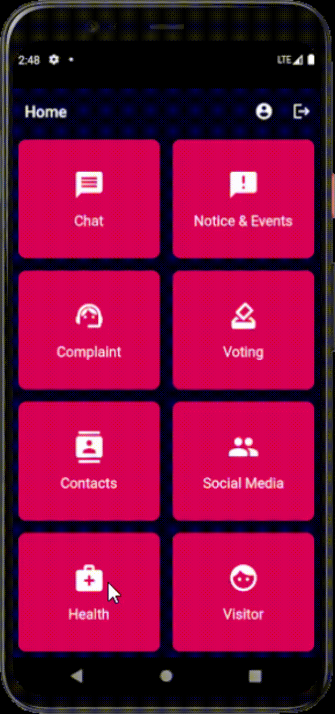

# housingsociety

Housing Society Management Application written in Flutter.

## Screenshots      
|Profile  									                    |Chat                                        |Notice                                        |
|-----------------------------------------------|--------------------------------------------|----------------------------------------------| 
||||
|Complaints								                      |Voting                                      |Contacts                                        |
||||
|Social Media 									                   |Health                                        |Visitor                                        |
|    |||

## Features
First user to register is given admin access by default. Rest of the users do not have admin access by default.
* User types
  * Admin 
    * give / revoke admin access
    * disable / enable access to application
  * User
  * Disabled
* Profile Management
  * Edit name, email, password, profile picture
* Chat
* Notice
  * Add, Edit, Delete notice (admin access required)
  * Translate into regional Indian languages
  * Text to speech
* Complaints
  * like, comment on complaints
  * Analyse complaints
* Voting (admin access required to initiate voting)
  * Set timer 
* Contacts
  * Add emergency contacts (admin access required)
* Social Media
  * Add photos
  * Follow/ unfollow users
* Health
* Visitor authentication
  * add / edit visitors (admin access required)
  * send sms to respective flat (admin access required)

## Getting Started

#### 1. [Setup Flutter](https://flutter.dev/docs/get-started/install)
#### 2. Clone the repo
```
$ https://github.com/arjun-14/housingsociety.git
```
#### 3. [Setup Firebase and firestore](https://firebase.google.com/)
* Enable authentication (email/ password)
* Enable Cloud Firestore
* Enable Storage

## What's next
* IOS support
